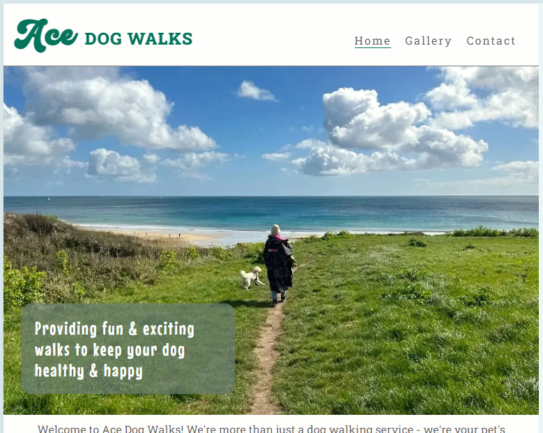

# Ace Dog Walks

Ace Dog Walks is a website for people wanting to find out more about the dog walking options offered by Ace Dog Walks, the cost of these walks and contact Hannah to book a walk or find out more.

The Ace Dog Walks site aims to help dog owners to feel reassured that their pet will be well looked after, that they will have a fun and energetic walk and that they are going to get value for money.

## Features

### Site Wide

***Favicon***
- A favicon of the letter 'A' from the Ace Dog Walks header logo so it is easily identifiable among multiple tabs.

***Navigation Menu***
- Makes it easy for the user to move around the site and find relevant information.
- Includes links to each page of the site (Home, Gallery and Contact). 
- Responsive design to work across devices of different sizes (uses less space and reduced logo with burger icon on smaller devices).

***Footer***

- Contains links to the Ace Dog Walks social media profiles so they can follow or find further information.
- These links open in a new tab and include accessibillity conventions such as aria labels.

### Home Page (index.html)

***Hero Image***

- Includes cover text with tagline for priorty message to users.
- Landscape image to convey happy dog on a walk in a natural outdoor setting.
- Selected image to work well with adjusted focus on different device sizes.

***Intro Text***
- Short introductory paragraph to provide some general info on Ace Dog Walks and what they do.
- Key messages to highlight main aims, values and priorities of Ace Dog Walks.   

***Why Book with Ace Dog Walks***

- Short bio on Hannah Brookes and her approach to dog-walking with a photo
- Section listing the reasons that the user (dog-owner) would choose Ace Dog Walks under two subheadings dog reasons and dog-owner reasons.
- Includes images of Hannah with happy dog/s to reinforce the listed reasons to choose Ace Dog Walks.
- The aim of this section is to build trust in Hannah and reassure the dog-owner that their dog will be safe and happy. 

### Gallery Page (gallery.html)

***Gallery***

- This image gallery includes a variety of images to create a hall of fame of dogs enjoying their Ace Dog Walks.
- Retro styling with rounded corners to complement other pages and give consistent look and feel.
- Images are arranged using responsive masory layout to ensure they look good on larger tablets and desktops. 

### Contact Page (contact.html)

- Provides contact details for Hannah and a form to submit an enquiry. 
- Form for dog-owners to provide personal information, details of their dog.
- Includes a variety of input types such as radio buttons and checkboxes for the dog-owner to select their preferred days / times to enable Hannah to check availability.

### Thank You Page (thank-you.html)

- Thank you page to let the user know that their form submission has been successful.
- Prompted by submit button in contact form (instead of CI form dump).

### 404 Error Page (404.html)

- Branded 404 error page with logo and button so the user can easily navigate back to the home page.
- Same site-wide styling as other pages to improve user experience and consistency.

### Existing Features

- Responsive hompepage with effective styling to look good on different sized devices.
- Responsive header and footer with hidden elements to improve appearance on smaller devices.
- Responsive gallery with complementary retro styling to tie in with other pages.
- Contact form with thank-you page triggered by submit.

### Additional Features to Implement
To expand on this site, there are a number of features that could be added to provide additional information and functionality:
- Submit action in contact form would send information to Hannah in email format and send a copy to the dog owner.
- A checkbox could be added to the 'dog-details' section to enable the user to add another dog if they have more than one.
- Add video content to gallery page, embedding reels and other video content from socials.
- Add a walk options page with examples of walk locations on a map with further images and costings.
 
## Design

### Responsive Homepage Layout

## Testing

### Links
Every link and hover link has been tested on each page of the site, including the navigation menu items, contact links and social media icon links in the footer in each page separately.

***Method of Testing***

Once deployed in Github, each page has been opened in turn and every link clicked on to check that the correct target was opened in a new tab.

Email links have been tested to ensure they open an email with the email address entered.

Telephone links have been tested to ensure they prompt the user to select an appropriate app to make a phone call.

***Results***

All links are fully working and open the expected link in a new tab or create a new email, or prompt the user to select a telephone application. 

### Responsiveness
Each page has been tested for responsive design on devices ranging from a minimum of 280px wide (Galaxy Fold), larger mobiles of 320, 350px and 425px and for tablets of 768px, laptops at 1024px and larger desktop screens.

***Method of Testing***

Once deployed in Github, each page has been viewed at each of the above marked out sizes within Google Developer Tools, and by clicking and dragging the screen size to the smallest and largest sizes.

To access Google Developer Tools:
- Click on Google menu (three dots in top left corner)
- Select 'More tools'
- Select '<> Developer tools'
- Opens the current page in an adaptive window where you can change size of device by clicking in different spaces in the top border above the screen preview

***Results***

All pages include responsive design and css to ensure that the layout is adapted to work on devices of all sizes. No images appear to be pixelated, squashed or stretched to fit the space and there is no overlap of elements.

### Form Inputs
Each input element in the form has been tested to ensure that it is the most appropriate input type and that all required information fields prompt a message requiring the user to complete that section before the form can be submitted.

***Method of Testing***

Once depolyed each input field, button or checkbox has been tested one by one to check:
- Where text or a combination of numbers and text is required (such as postcode or age of dog in Yrs and or Mths), then input type="text" has been used.
- Where an email address is required, then input type="email" has been used.
- Where a number alone is required, then input type="number" has been used.
- Where a telephone number is required, then input type="tel" has been used. 
- Where one choice of a selection of defined choices is required, then input type="radio" has been used for each option.
- Where multiple choices can be made from a selection of options, then input type="checkbox" has been used for each option.
- That any fields which are required content prompt an automated message to ask the user to complete that field before the form can be submitted.

***Results***

All expected input types have been used for the appropriate fields
The expected prompts appear for each of the fields with a 'required' indicator.

If there is no @ symbol included in the email field, this prompts a message to highlight that a recognisable email format must be entered before submitting.

### Validator Testing

- HTML
    - No errors were returned when passing through the official [W3C validator](https://validator.w3.org/) 
    - Full screenshots available in docs folder.

- CSS
    - No errors were found when passing through the official [(Jigsaw) validator](https://jigsaw.w3.org/css-validator/)

- Lighthouse Testing
    - Good scores achieved for all pages. Full screenshots available in docs folder.

### Unfixed Bugs

All pages are working as expected and on devices of all sizes. There are no unfixed bugs known of at the time of submitting for marking. 

A section of code was removed from the Content html and page and css which was intended to enable the user to select a checkbox in order to reveal a hidden repeated 'dog details' sections so they can add a second dog to their enquiry. This was not a fundamental requirement for the success of the form, so the broken code was removed.

Upon investigation online it appears that using Javascript would be ideal for creating this functionality.

## Deployment

### Gitpod Version Control
This site was created using the Gitpod cloud development environment before being pushed through to a dedicated repository on Github.

The following commands were used througout development to push the code through to the Github repo:

- git add . - This command was used to add any tracked files to the staging area.
- git commit -m "Commit message." - This command was used to create a snapshot of the staged area with a short description.
- git push - This command was used to push the committed changes from the current branch to the remote repository on Github.

### Deployment

- The site was deployed to GitHub pages. The steps to deploy are as follows: 
  - In the GitHub repository, navigate to the Settings tab
  - Select Pages link in the left hand menu 
  - From the source section drop-down menu, select the Main Branch
  - Click 'Save'
  - Once the main branch has been selected, the page will be automatically refreshed with a detailed ribbon display to indicate the successful deployment. 

The live link can be found here https://sophie-thomson.github.io/ace-dog-walks/

## Credits

### Content

- Sections of html and css code for the site-wide header and footer was adapted from the Code Institute Love Running walkthrough project.
- All icons were imported from [Font Awesome](https://fontawesome.com/)
- The fonts 'Roboto Slab' and 'Spicy Rice' were imported from [Googlefonts](https://fonts.google.com/)
- The logo font 'Roadster' was downloaded free for personal use from [fontspace](https://www.fontspace.com/roadster-script-font-f95087) and is designed by [Pentype Studio](https://www.fontspace.com/pentype-studio).
- The [README document for Taco's Travels](https://github.com/Gareth-McGirr/tacos-travels/blob/main/README.md) was used as a example reference for the structure and layout of Ace Dog Walks README.md

### Media

- The photos used on the home page and gallery are all provided by Hannah Sharpe (Ace Dog Walks owner), and are her own images.
- The multi-mockup image to illustrate the responsive design of the site was generated using techsini.com [multi device website mockup generator](https://techsini.com/multi-mockup/index.php)

## Code & Technology
 The following code, platforms and apps were used in the creation of this site:
 - HTML
 - CSS
 - Gitpod
 - Github
 - Font Awesome
 - Convertio.co
 - Tinypng
 - Favicon.io
 - Balsamiq
 - Google fonts