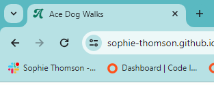

# Ace Dog Walks

Ace Dog Walks is a website for people wanting to find out more about the dog walking options offered by Ace Dog Walks, the cost of these walks and contact Hannah to book a walk or find out more.

The Ace Dog Walks site aims to help dog owners to feel reassured that their pet will be well looked after, that they will have a fun and energetic walk and that they are going to get value for money.

## Features

### Site Wide

***Favicon***
- A favicon of the letter 'A' from the Ace Dog Walks header logo so it is easily identifiable among multiple tabs.

***Navigation Menu***
- Makes it easy for the user to move around the site and find relevant information.
- Includes links to each page of the site (Home, Gallery and Contact). 
- Responsive design to work across devices of different sizes (uses less space and reduced logo with burger icon on smaller devices).

***Footer***

- Contains links to the Ace Dog Walks social media profiles so they can follow or find further information.
- These links open in a new tab and include accessibillity conventions such as aria labels.

![Placeholder for screenshot of footer bar]

### Home Page (index.html)

***Hero Image***

- Includes cover text with tagline for priorty message to users.
- Landscape image to convey happy dog on a walk in a natural outdoor setting.
- Selected image to work well with adjusted focus on different device sizes.

![Placeholder for screenshot of hero image]

***Why Choose Ace Dog Walks***

- Short bio on Hannah Brookes and her approach to dog-walking with a photo
- Section listing the reasons that the user (dog-owner) would choose Ace Dog Walks under two subheadings dog reasons and dog-owner reasons.
- Includes images of Hannah with happy dog/s to reinforce the listed reasons to choose Ace Dog Walks.
- The aim of this section is to build trust in Hannah and reassure the dog-owner that their dog will be safe and happy. 

![Placeholder for screenshot of Why Book with Ace Dog Walks section]

***Walk Options***

- Examples of walk locations to provide dog owner with an idea of the kinds of walks available.
- Background image of each walk location with cover text providing details and walk type icon.
- Examples arranged using flexbox so they are responsive and arranged nicely on different devices.

![Placeholder for screenshot of Walk Options section]

### Gallery Page (gallery.html)

***Gallery***

- This image gallery will include a variety of images to create a hall of fame of dogs that already enjoy Ace Dog Walks.
- Images will be formatted using the masory layout and are responsive so that they look good on devices of different sizes. 

![Placeholder for screenshot of Gallery page]

### Contact Page (contact.html)

- A form for dog-owners to contact Hannah and provide personal information, details of their dog and the reason for their enquiry.
- Includes checkboxes for the dog-owner to select their main priorities for their dog and preferred days / times to check availability.

![Placeholder for screenshot of Contact page]

### Existing Features

- Responsive design has been used throughout the site to ensure it looks good on different sized devices.
- xxxxxxxxxxxxxxxxxxx
- xxxxxxxxxxxxxxxxxxx

### Features Left to Implement

- Submit option in contact form to send information to Hannah in email format and send a copy to the dog owner.
- Add video content to gallery page. 
 
## Design

### Homepage Layout

## Testing

### Validator Testing

- HTML
    - No errors were returned when passing through the official [W3C validator](https://validator.w3.org/)

- CSS
    - No errors were found when passing through the official [(Jigsaw) validator](https://jigsaw.w3.org/css-validator/)

### Unfixed Bugs

You will need to mention unfixed bugs and why they were not fixed. This section should include shortcomings of the frameworks or technologies used. Although time can be a big variable to consider, paucity of time and difficulty understanding implementation is not a valid reason to leave bugs unfixed. 

## Deployment

This section should describe the process you went through to deploy the project to a hosting platform (e.g. GitHub) 

- The site was deployed to GitHub pages. The steps to deploy are as follows: 
  - In the GitHub repository, navigate to the Settings tab
  - Select Pages link in the left hand menu 
  - From the source section drop-down menu, select the Main Branch
  - Once the main branch has been selected, the page will be automatically refreshed with a detailed ribbon display to indicate the successful deployment. 

The live link can be found here https://sophie-thomson.github.io/ace-dog-walks/

## Credits

### Content

- Sections of html and css code for the Home Page was taken from the Code Institute Love Running walkthrough project.
- The icons in the footer were taken from [Font Awesome](https://fontawesome.com/)

### Media

- The photos used on the home page and contact form are from This Open Source site
- The images used for the gallery page were taken from this other open source site